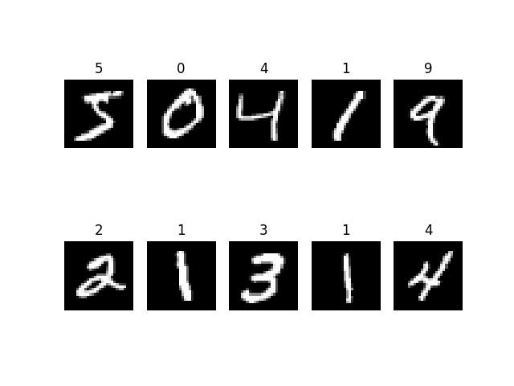
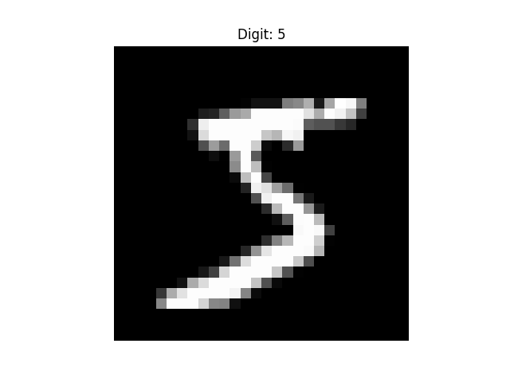
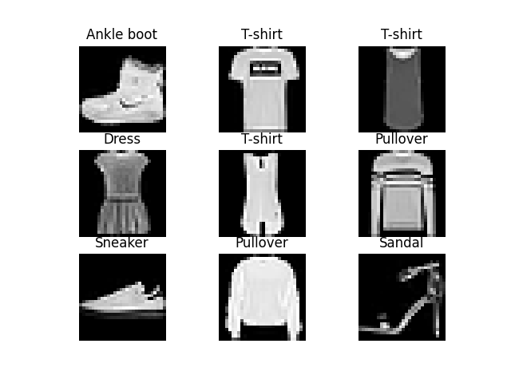

# Deep Learning & CNN Image Classification Project

## Overview
This repository documents my **Deep Learning learning journey (Day 46 – Day 60)** where I built and trained multiple neural network models using **TensorFlow / Keras**.

The final outcome of this phase is a **Convolutional Neural Network (CNN) Image Classification system** trained on the **Fashion-MNIST dataset** to recognize clothing items.

This project demonstrates the **complete deep learning workflow used in real-world AI systems**, including:

- Neural network fundamentals
- Model training and evaluation
- Handling overfitting
- Saving and loading models
- Building CNN architectures
- Image classification
- Model improvement
- Prediction demos

---

# Technologies Used

- Python
- TensorFlow
- Keras
- NumPy
- Matplotlib
- Jupyter Notebook
- Git & GitHub

---

# Dataset

The models were trained using the **Fashion-MNIST dataset**.

Fashion-MNIST contains **70,000 grayscale images of clothing items** across **10 classes**.

Image Details:

- Image Size: **28 × 28 pixels**
- Format: **Grayscale**

### Clothing Categories

| Label | Clothing Item |
|------|---------------|
| 0 | T-shirt/top |
| 1 | Trouser |
| 2 | Pullover |
| 3 | Dress |
| 4 | Coat |
| 5 | Sandal |
| 6 | Shirt |
| 7 | Sneaker |
| 8 | Bag |
| 9 | Ankle boot |

---

# Sample Dataset Images

### MNIST Digit Samples

### Single Digit Example

### Fashion Dataset Sample

---

# CNN Prediction Example

Example output from the CNN model:

The trained model predicts the clothing category based on the image.

---

# Project Structure
# Deep Learning & CNN Image Classification Project

## Overview
This repository documents my **Deep Learning learning journey (Day 46 – Day 60)** where I built and trained multiple neural network models using **TensorFlow / Keras**.

The final outcome of this phase is a **Convolutional Neural Network (CNN) Image Classification system** trained on the **Fashion-MNIST dataset** to recognize clothing items.

This project demonstrates the **complete deep learning workflow used in real-world AI systems**, including:

- Neural network fundamentals
- Model training and evaluation
- Handling overfitting
- Saving and loading models
- Building CNN architectures
- Image classification
- Model improvement
- Prediction demos

---

# Technologies Used

- Python
- TensorFlow
- Keras
- NumPy
- Matplotlib
- Jupyter Notebook
- Git & GitHub

---

# Dataset

The models were trained using the **Fashion-MNIST dataset**.

Fashion-MNIST contains **70,000 grayscale images of clothing items** across **10 classes**.

Image Details:

- Image Size: **28 × 28 pixels**
- Format: **Grayscale**

### Clothing Categories

| Label | Clothing Item |
|------|---------------|
| 0 | T-shirt/top |
| 1 | Trouser |
| 2 | Pullover |
| 3 | Dress |
| 4 | Coat |
| 5 | Sandal |
| 6 | Shirt |
| 7 | Sneaker |
| 8 | Bag |
| 9 | Ankle boot |

---

# Sample Dataset Images

### MNIST Digit Samples

### Single Digit Example

### Fashion Dataset Sample

---

# CNN Prediction Example

Example output from the CNN model:

The trained model predicts the clothing category based on the image.

---

# Project Structure
DEEP-LEARNING-NLP/

models/
fashion_cnn.keras
fashion_cnn_improved.keras
model_day52.keras
model_day54_cnn.keras

notebooks/
day46_tensorflow_setup.ipynb
day47_neural_network_basics.ipynb
day48_first_ann.ipynb
day49_loss_optimizer.ipynb
day50_overfitting.ipynb
day51_model_evaluation.ipynb
day52_save_load_models.ipynb
day53_intro_cnn.ipynb
day54_image_classification_basics.ipynb
day55_fashion_dataset.ipynb
day56_fashion_cnn.ipynb
day57_fashion_predictions.ipynb
day58_model_analysis.ipynb
day59_cnn_improvement.ipynb
day60_cnn_demo.ipynb

output/
cnn_prediction_example.png
fashion_sample.png
mnist_sample_digits.png
mnist_single_digit_example.png

---

# Model Development Journey

## Day 46 – TensorFlow Setup
- Installed TensorFlow
- Verified deep learning environment

## Day 47 – Neural Network Basics
- Understanding neurons
- Activation functions
- Forward propagation

## Day 48 – First Artificial Neural Network
- Built first ANN using TensorFlow
- Basic classification model

## Day 49 – Loss Functions & Optimizers
Implemented:

- Cross entropy loss
- Adam optimizer

## Day 50 – Handling Overfitting
Applied techniques to improve model generalization:

- Dropout
- Early stopping

## Day 51 – Model Evaluation
Model performance measured using:

- Accuracy
- Loss

## Day 52 – Saving & Loading Models
Implemented model persistence:

- Saving models using `.keras`
- Loading trained models for inference

## Day 53 – Introduction to CNN
Learned CNN fundamentals:

- Convolution layers
- Filters
- Feature extraction
- Pooling layers

## Day 54 – Image Classification Basics
Prepared image data for CNN:

- Image normalization
- Reshaping data
- Preparing tensors for CNN input

## Day 55 – Dataset Exploration
Explored Fashion-MNIST:

- Visualized clothing images
- Inspected labels
- Understood dataset structure

## Day 56 – First CNN Model
Built first convolutional neural network using:

- Convolution layers
- MaxPooling
- Dense layers

## Day 57 – CNN Predictions
Implemented prediction pipeline:

- Generated predictions
- Visualized model outputs

## Day 58 – Model Analysis
Analyzed model performance and prediction results.

## Day 59 – CNN Improvement
Improved CNN architecture by adding:

- Additional convolution layers
- Dropout regularization

## Day 60 – Final CNN Demo
Created full inference pipeline:

1. Load trained model
2. Predict clothing category
3. Display predicted label
4. Compare predicted vs actual label

---

# Key Learnings

This project helped build strong understanding of:

- Deep learning model pipelines
- CNN architecture design
- Image preprocessing
- Model training and evaluation
- Model versioning
- Prediction pipelines

---

# Future Work

Next steps in the learning journey:

- Computer Vision with OpenCV
- Transfer Learning
- Object Detection
- Real-world AI applications

---

# Author

**Abhihail Jacob**

Learning journey toward becoming a **Python AI Engineer**.